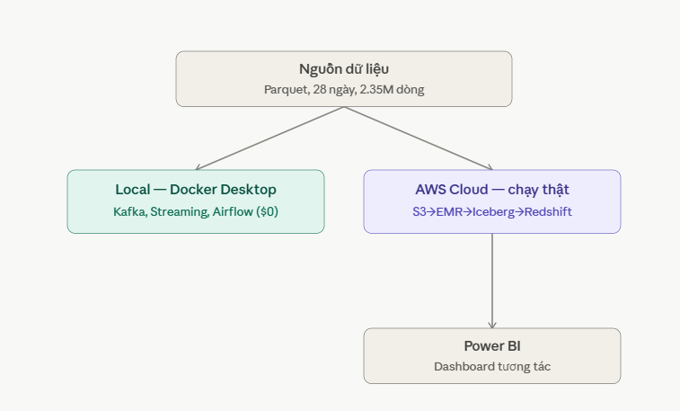
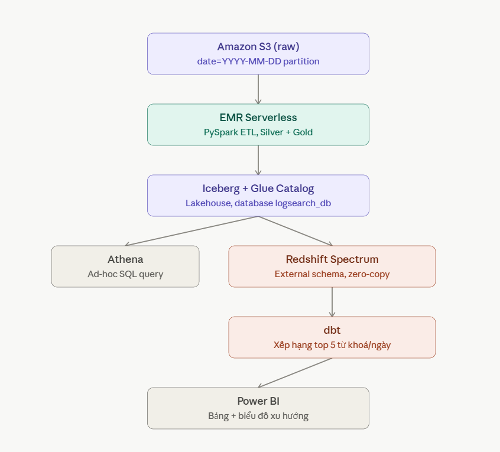
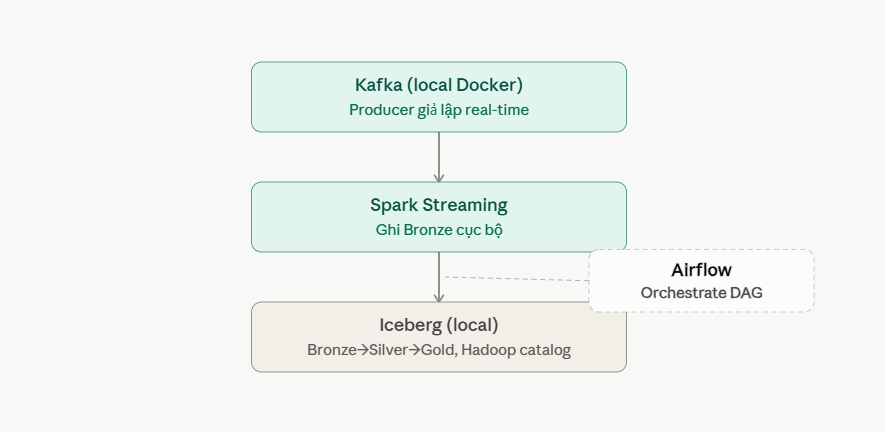
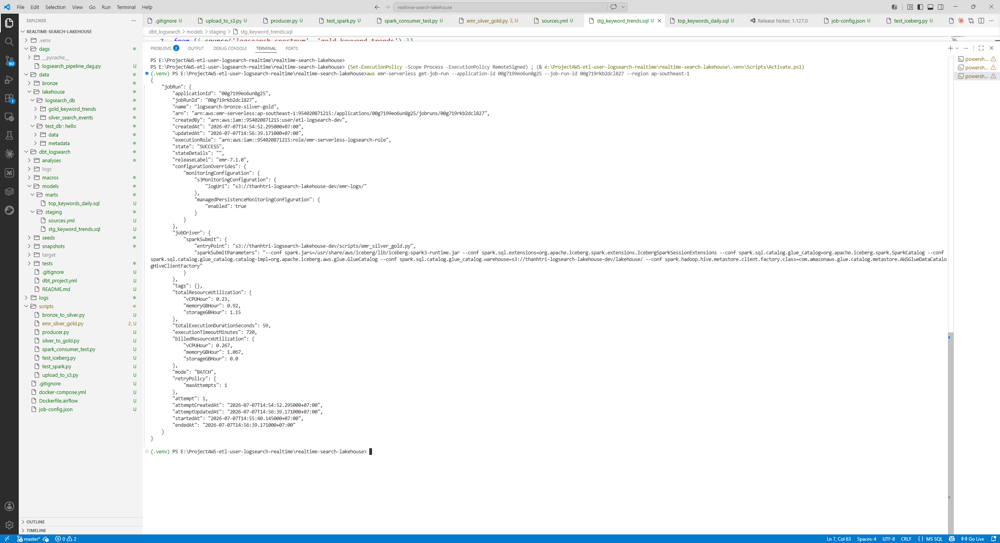
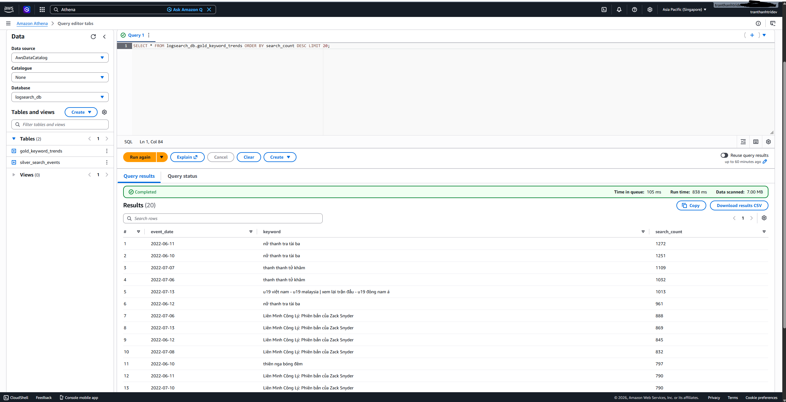
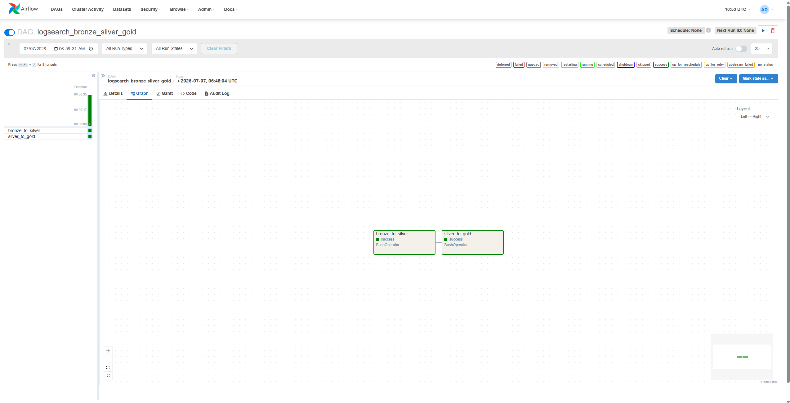
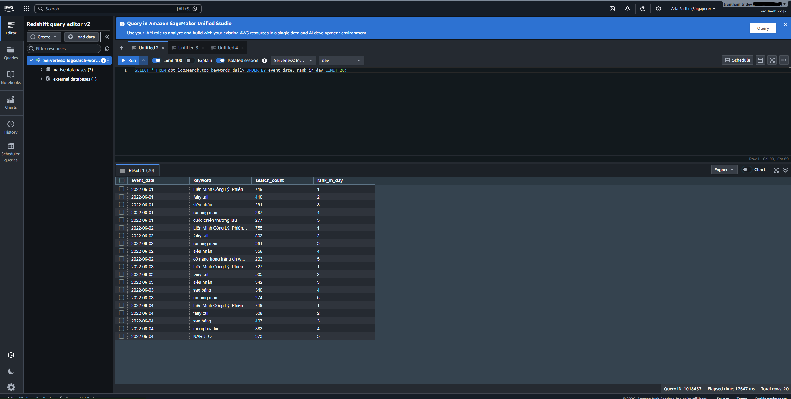
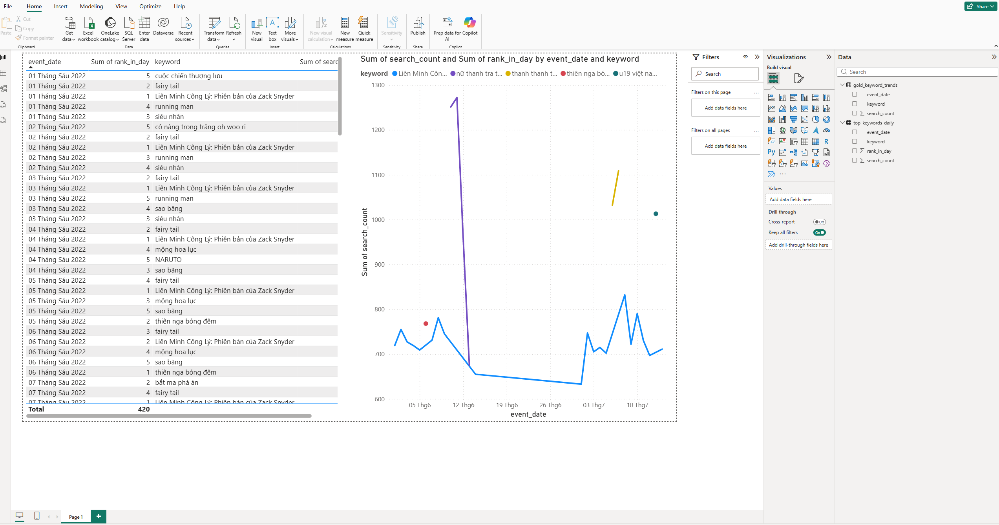

# Realtime Search Analytics Lakehouse

Pipeline ETL/ELT thời gian thực xử lý log hành vi tìm kiếm trên nền tảng xem phim OTT (FPT Play), dùng kiến trúc Medallion (Bronze/Silver/Gold) trên AWS, trọng tâm **Apache Iceberg lakehouse + dbt + Airflow**.

## Kiến trúc

**Tổng quan** — 1 nguồn dữ liệu, tách 2 luồng: Local (chứng minh cơ chế streaming, $0) và AWS Cloud (pipeline chạy thật):



**Chi tiết nhánh AWS** — S3 → EMR Serverless → Iceberg/Glue Catalog → rẽ Athena (ad-hoc) và Redshift Spectrum → dbt → Power BI:



**Chi tiết nhánh Local** — Kafka → Spark Structured Streaming → Iceberg (Hadoop catalog), orchestrate bằng Airflow:



## Nguồn dữ liệu

Log tìm kiếm dạng Parquet từ nền tảng xem phim OTT, 28 ngày (2022-06-01 → 06-14, 2022-07-01 → 07-14), **2.351.335 dòng** sau khi làm sạch. 10 cột: `eventID, datetime, user_id, keyword, category (enter/quit), proxy_isp, platform, networkType, action, userPlansMap`.

## Câu hỏi nghiệp vụ trả lời được

- Từ khoá tìm kiếm xu hướng theo ngày, phát hiện nội dung viral (tăng đột biến)
- Xếp hạng top 5 từ khoá mỗi ngày (window function)
- Tỉ lệ enter→quit theo category
- Phân bổ theo platform (mobile/smarttv/web) và ISP

## Tech stack

| Layer | Công nghệ |
|---|---|
| Streaming | Apache Kafka (Docker local) |
| Stream processing | Spark Structured Streaming |
| Data lake | Amazon S3 |
| Batch processing | Amazon EMR Serverless (PySpark) |
| Table format | Apache Iceberg |
| Metadata catalog | AWS Glue Data Catalog |
| Ad-hoc query | Amazon Athena |
| Orchestration | Apache Airflow (Docker local) |
| Data warehouse | Amazon Redshift Serverless + Redshift Spectrum |
| Transformation | dbt (dbt-redshift) |
| BI | Power BI |

## Kết quả nổi bật

- Xử lý **2.351.335 dòng** (28 ngày) qua toàn bộ pipeline Bronze → Silver → Gold, chạy cả local lẫn AWS thật.
- Job EMR Serverless xử lý toàn bộ dữ liệu chỉ tốn **~$0.02** (0.267 vCPU-hour), chạy trong 59 giây.
- Model dbt dùng `ROW_NUMBER()` xếp hạng top 5 từ khoá/ngày — phát hiện "Liên Minh Công Lý: Phiên bản của Zack Snyder" giữ ngôi #1 xuyên suốt nhiều tuần, xen kẽ các đợt tăng đột biến (viral spike) của nội dung khác.
- Xử lý dữ liệu bẩn thực tế: thiết bị ghi giờ theo lịch Phật giáo Thái Lan (năm 2565 = 2022+543), đồng hồ thiết bị lỗi (năm 0004/0034), lệch tháng — dùng ngày partition làm mốc tin cậy thay vì tin hoàn toàn theo cột `datetime`.
- Toàn bộ phần AWS thật (EMR Serverless, Redshift Serverless, Athena) hoàn thành với **chi phí dưới $1**, nhờ chiến lược "local trước, AWS sau" và tận dụng Redshift Serverless free trial ($300/90 ngày).

## Kiến trúc chi phí

Chủ động tránh 2 dịch vụ managed đắt đỏ không cần thiết cho quy mô nhỏ:
- **Amazon MSK** (Kafka managed) → Kafka Docker local (tiết kiệm ~$460/tháng)
- **Amazon MWAA** (Airflow managed) → Airflow Docker local (tiết kiệm $0.49/giờ chạy liên tục)

Chỉ dùng AWS thật cho phần không thể thay thế: EMR Serverless (tính theo giây), Redshift Serverless (free trial), Athena/S3/Glue (chi phí không đáng kể).

## Cấu trúc repo

```
├── dags/                          # Airflow DAG
│   └── logsearch_pipeline_dag.py
├── data/                          # Bronze + lakehouse local (Hadoop catalog)
│   ├── bronze/
│   └── lakehouse/logsearch_db/
├── dbt_logsearch/                 # dbt project
│   └── models/
│       ├── staging/               # sources.yml, stg_keyword_trends.sql
│       └── marts/                 # top_keywords_daily.sql
├── docs/                          # Sơ đồ kiến trúc + ảnh bằng chứng
├── scripts/
│   ├── producer.py                # Giả lập real-time → Kafka
│   ├── spark_consumer_test.py     # Kafka → Bronze (Spark Streaming)
│   ├── bronze_to_silver.py        # Local Iceberg transform
│   ├── silver_to_gold.py          # Local Iceberg aggregation
│   ├── emr_silver_gold.py         # EMR Serverless: S3 → Iceberg/Glue
│   └── upload_to_s3.py            # Batch upload raw Parquet → S3
├── docker-compose.yml             # Kafka + Zookeeper + Airflow (local)
├── Dockerfile.airflow             # Airflow image + Java + PySpark
└── job-config.json                # Cấu hình submit job EMR Serverless
```

## Setup

Xem chi tiết từng bước (bao gồm toàn bộ lỗi thực tế đã gặp và cách sửa) trong [`etl-pipeline-runbook.md`](./etl-pipeline-runbook.md).

Tóm tắt nhanh:
```bash
docker compose up -d                              # Kafka + Airflow local
python scripts/producer.py                        # giả lập streaming
docker exec airflow-scheduler python /opt/airflow/scripts/spark_consumer_test.py
aws emr-serverless start-job-run --cli-input-json file://job-config.json
cd dbt_logsearch && dbt run                        # transform trong Redshift
```

## Bằng chứng thực thi

| | |
|---|---|
|  |  |
|  |  |
|  | |

## Bài học kỹ thuật đáng chú ý

- **EMR Serverless không có Internet access mặc định** — không tải được connector qua Maven (`spark.jars.packages`); phải dùng jar Iceberg có sẵn trong runtime (`/usr/share/aws/iceberg/lib/iceberg-spark3-runtime.jar`).
- **Redshift không cho tạo VIEW trực tiếp trên external table** (Spectrum) — model dbt đầu tiên đọc từ nguồn external phải materialize thành `table`.
- **Spark Structured Streaming file sink lưu đường dẫn tuyệt đối lúc ghi** vào `_spark_metadata` — ghi và đọc phải cùng 1 môi trường (container), không trộn Windows/Linux.
- **Kafka cần 2 listener riêng** để phục vụ đồng thời client trên host (Windows) và client trong cùng mạng Docker.
- **EMR Serverless và Redshift Serverless không có managed policy IAM dựng sẵn** như S3/Glue/Athena — phải tự viết custom policy cho user, và tự thêm quyền Glue/S3 cho IAM role của Redshift Spectrum.

## License

## Author
**Trần Thanh Trí** — Data Engineer
Focus: Big Data - ETL/ELT - Data Lakehouse - Data Pipeline - AWS/GCP
LinkedIn: https://linkedin.com/in/thanhtri0909
Email: tranthanhtri0147@example.com